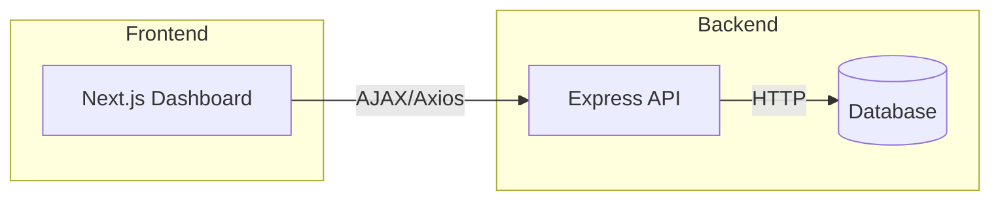

# ConWise Application

ConWise is a full‑stack construction management system composed of
separate **backend** and **frontend** services. The backend is a Node.js
API that uses Express and Prisma to manage data stored in a relational
database. The frontend is a Next.js (React) dashboard application used
by different user roles (admin, project manager, site engineer, and
supervisor).

---

## Architecture Overview



* The **Backend** exposes a RESTful JSON API under `/api`.
* The **Frontend** communicates with the backend via `axios`, using
environment variable `NEXT_PUBLIC_API_URL`.
* Authentication is done with JWTs; the frontend stores tokens and
sends them in `Authorization` headers.

---

## Folder Structure

This is a high‑level view of the repository:

```
ConWise/
├─ backend/                 # Express + Prisma API
├─ frontend/                # Next.js dashboard
├─ .gitignore
└─ README.md                # this file
```

### backend/

The backend directory follows a modular architecture where each
business domain lives under `modules/`. Middleware and shared utilities
are located at the top level. The entry point is `src/server.js` which
configures Express, mounts routers, and starts the HTTP listener.

```
backend/
├─ package.json            # dependencies & scripts
├─ prisma.config.ts        # Prisma configuration
├─ prisma/                 # Prisma schema and migrations
│   └─ schema.prisma
├─ src/
│   ├─ server.js           # entrypoint, Express setup
│   ├─ config/             # constants, env loading, prisma client
│   │   ├─ constants.js    # application-wide constants
│   │   ├─ env.js          # process.env validation & exports
│   │   └─ prisma.js       # Prisma client instance
│   ├─ middlewares/        # auth, validation, error handling
│   │   ├─ auth.middleware.js      # checks JWT and attaches user
│   │   ├─ error.middleware.js     # centralized error handler
│   │   ├─ notFound.middleware.js  # 404 response generator
│   │   ├─ role.middleware.js      # role-based access control
│   │   └─ validate.middleware.js  # request body validation helper
│   ├─ modules/            # domain sub‑systems
│   │   ├─ auth/           # authentication, sessions, roles
│   │   │   ├─ auth.controller.js
│   │   │   ├─ auth.routes.js
│   │   │   ├─ auth.service.js
│   │   │   ├─ auth.validation.js
│   │   │   ├─ role.service.js
│   │   │   └─ session.service.js
│   │   ├─ project/        # project management logic
│   │   │   └─ project.*
│   │   ├─ task/ …
│   │   └─ analytics/ …
│   ├─ routes/             # main router aggregator
│   │   └─ index.js        # imports module routes and applies to app
│   └─ utils/              # shared utilities
│       ├─ catchAsync.js   # wrapper to handle async errors
│       ├─ generateToken.js# JWT creation helper
│       ├─ hash.js         # password hashing and verification
│       └─ pagination.js   # common pagination helper
```

Each folder is briefly described above; pick individual files for
examples when writing code or debugging.

> **Database & Prisma**
>
> The Prisma schema defines models for users, projects, tasks, etc. The
> connection string is loaded via environment variables. Run
> `npx prisma migrate dev` for schema changes and `npx prisma studio` to
> inspect data.

> **Database & Prisma**
>
> The Prisma schema defines models for users, projects, tasks, etc. The
> connection string is loaded via environment variables. Run
> `npx prisma migrate dev` for schema changes and `npx prisma studio` to
> inspect data.

### frontend/

The frontend is a Next.js 14 app with an `app` router and Tailwind for
styles. It is structured around features and shared components.

```
frontend/
├─ jsconfig.json           # path aliases
├─ next.config.mjs         # Next.js config
├─ package.json            # dependencies & scripts
├─ postcss.config.mjs      # Tailwind
├─ public/                 # static assets
└─ src/
   ├─ loading.jsx          # spinner
   ├─ api/                 # HTTP helpers (axios.js)
   ├─ app/                 # routes, layouts, dashboards
   │   ├─ globals.css
   │   ├─ layout.js
   │   ├─ page.js
   │   ├─ dashboard/
   │   │   ├─ admin/
   │   │   ├─ project-manager/
   │   │   ├─ site-engineer/
   │   │   └─ supervisor/
   │   ├─ layout/ …
   │   ├─ login/ …
   │   └─ services/ …
   ├─ components/          # UI building blocks
   ├─ features/            # domain logic (e.g. project)
   ├─ hooks/               # custom React hooks
   ├─ lib/                 # misc helpers
   └─ middleware/          # Next.js middleware routes
```

> **Communication**
>
> The frontend uses `src/api/axios.js` to configure the base URL and
> interceptors. Authentication state is managed in `hooks/useAuth.js`.

---

## Development Workflow

1. **Backend**
   ```bash
   cd backend
   npm install
   # create .env with DATABASE_URL, JWT_SECRET, etc.
   npm run dev
   ```
   The API listens on port `5000` by default.

2. **Frontend**
   ```bash
   cd frontend
   npm install
   # create .env.local with NEXT_PUBLIC_API_URL=http://localhost:5000/api
   npm run dev
   ```
   Access the app at `http://localhost:3000`.

3. **Database**
   * Use `npx prisma migrate dev` to apply schema changes during
     development.
   * Inspect with `npx prisma studio`.

4. **Testing & Linting**
   * Backend: (if tests exist) `npm test`.
   * Frontend: `npm run lint` and add tests using React Testing Library.

---

## Deployment

* **Backend** can be deployed to any Node‑capable host (Heroku, Azure
  Web Apps, etc.) with the proper environment variables.
* **Frontend** can be built (`npm run build`) and hosted on Vercel,
  Netlify, or served from the backend as static assets.
* Ensure CORS is configured on the backend to allow frontend origin.

---

## Contributing Guidelines

* Follow the module structure when adding new features.
* Keep controllers thin; business logic belongs in services.
* Write validation schemas using the existing pattern.
* Update README sections if new folders or workflows are introduced.

---

## Additional Resources

| Area      | Reference |
|-----------|-----------|
| Next.js   | https://nextjs.org/docs |
| Express   | https://expressjs.com/ |
| Prisma    | https://www.prisma.io/docs |
| Tailwind  | https://tailwindcss.com/docs |
| Axios     | https://axios-http.com/docs/intro |

---

> 📌 This README is intended to give new developers a clear, professional
> overview of the ConWise codebase. For further details, explore the
> comments in the code and individual module README files if provided.
